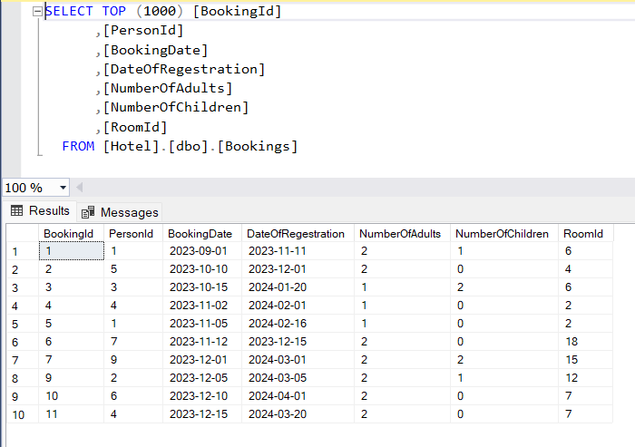

# Hotel_Database_SQL :hotel:
This is an example of a simple database storing basic information related to room reservations in a hotel.

## The project consists of 7 tables:

  * Bookings
      - BookingId
      - PersonId
      - BookingDate
      - DateOfRegestration
      - NumberOfAdults
      - NumberOfChildren
      - RoomId
   
        
        
  * Specifications
      - BookingId
      - PersonId
      - DateOfCheckOut
      - RoomId
        
  * Guests
      - PersonId
      - FirstName
      - Surname
      - City
      - PostCode
      - Street
      - FlatHouseNumber
        
  * Rooms
      - RoomID
      - RoomNumber
      - Floor
      - MaxNumberOfGuests
      - StandardId
        
  * RoomStandards
      - StandardId
      - PricePerPerson
      - PricePerChild
        
  * BookingChanges
    Contains the same columns as the Bookings table. 
    Used to store changed records in the Bookings table.
    
  * DeletedGuests
    Contains the same columns as the Guests table. 
    Used to store deleted records in the Guests table.

## Diagram

## The project also includes views:

  * BookingPanel  
    <i>Provides a detailed view of reservations</i>
     - BookingId
     - BookingDate
     - FirstName
     - Surname
     - RoomNumber
     - DateOfRegestration
     - DateOfCheckOut
     - NumberOfAdults
     - NumberOfChildren
     - Price

     
       
  * GuestsNumOfBooking  
    <i>Shows how many bookings a particular customer has made</i>
      - FirstName
      - Surname
      - City
      - NumOfBookings
   
     
    
  * RoomPrices  
    <i>Presents prices of all rooms</i>
     - RoomNumber
     - Floor
     - MaxNumberOfGuests
     - PricePerPerson
     - PricePerChild
     - PriceFrom (lowest possible price per room)
     - PriceTo (highest possible price per room)
   
     
   
## To gain greater control when making changes or deleting data, I added triggers:

  * BookingsTriggerD  
  When attempting to delete a booking, a message is displayed informing that deleting rows in this table is not allowed.
  * BookingsTriggerU  
  After updating a row in the 'Bookings' table, a record is inserted into the 'BookingChanges' table before the update, so that records can be compared later if it is necessary to see what has changed.
  * GuestsDeleteTrigger  
  After deleting a guest from the database, they are saved to the 'DeletedGuests' table.
  * GuestsUpdateTrigger  
  After updating a row in the 'Guest' table, a message is displayed about the change.
  * NewGuestTrigger  
  After adding a new row to the 'Guest' table, a message is displayed informing about adding a new guest.
  * RoomsTrigger  
  Functions similarly to 'BookingsTriggerD'; when attempting to delete a room, a message is displayed indicating that deleting rows in this table is not allowed.
  * SpecificationTrigger  
  The same scheme as in the case of 'BookingsTriggerD' and 'RoomsTrigger'.
  * SpecificationTriggerU  
  After updating a row in the 'Specifications' table, a message is displayed about this change.
  * PreventTableDeletion  
  When attempting to delete a table from the database, an error message is displayed stating that deleting tables from the database is not allowed, and then the deletion operation is rolled back. This trigger prevents accidental deletion of tables from the database.

---

 

# Baza danych - Hotel :hotel:

Jest to przykład prostej bazy danych przechowującej podstawowe informacje związane z rezerwacją pokoju w hotelu.

## Projekt składa się z 7 tabel:

  * Bookings
      - BookingId
      - PersonId
      - BookingDate
      - DateOfRegestration
      - NumberOfAdults
      - NumberOfChildren
      - RoomId
        
      
        
  * Specifications
      - BookingId
      - PersonId
      - DateOfCheckOut
      - RoomId
        
  * Guests
      - PersonId
      - FirstName
      - Surname
      - City
      - PostCode
      - Street
      - FlatHouseNumber
        
  * Rooms
      - RoomID
      - RoomNumber
      - Floor
      - MaxNumberOfGuests
      - StandardId
        
  * RoomStandards
      - StandardId
      - PricePerPerson
      - PricePerChild
        
  * BookingChanges
    Zawiera te same kolumny co tabela Bookings. 
    Służy do przechowywania zmienionych rekordów w tabeli Bookings.
    
  * DeletedGuests
    Zawiera te same kolumny co tabela Guests. 
    Służy do przechowywania usuniętych rekordów w tabeli Guests.

## Diagram

## W projekcie utworzone zostały również widoki:

  * BookingPanel  
    <i>Stanowi szczegółowy podgląd do rezerwacji</i>
     - BookingId
     - BookingDate
     - FirstName
     - Surname
     - RoomNumber
     - DateOfRegestration
     - DateOfCheckOut
     - NumberOfAdults
     - NumberOfChildren
     - Price
       
    
       
  * GuestsNumOfBooking  
    <i>Pokazuje ile rezerwacji dokonał dany klient</i>
      - FirstName
      - Surname
      - City
      - NumOfBookings

      

    
  * RoomPrices  
    <i>Przedstawia ceny wszsystkich pokoi</i>
     - RoomNumber
     - Floor
     - MaxNumberOfGuests
     - PricePerPerson
     - PricePerChild
     - PriceFrom (najniższa możliwa cena za pokój)
     - PriceTo (najwyższa możliwa cena za pokój)
       

   
## Aby zyskać większą kontrolę w przypadku wprowadzania zmian lub usuwania danych dodałam wyzwalacze
  * BookingsTriggerD  
  Przy próbie usunięcia rezerwacji, zostaje wyświetlony komunikat informujący, że usuwanie wierszy w tej tablei jest niedozwolone.
  * BookingsTriggerU  
  Po aktualizacji wiersza w tabeli 'Bookings' do tabeli 'BookingChanges zostaje wstawiony rekord przed aktualizacją, aby można było później w razie potrzeby porównać rekordy i zobaczyć co zostało zmienione. 
  * GuestsDeleteTrigger  
  Po usunięciu danego gościa z bazy danych, zostaje on zapisany do tabeli 'DeletedGuests'.
  * GuestsUpdateTrigger  
  Po aktualizacji wiersza w tabeli 'Guest' zostaje wyświetlony komunikat o zmianie.
  * NewGuestTrigger  
  Po dodaniu nowego wiersza do tabeli 'Guest', wyświetlony zostaje komunikat, informujący o dodaniu nowego gościa.
  * RoomsTrigger  
  Działa na tej samej zasadzie co 'BookingsTriggerD', czyli przy próbie usunięcia w tym przypadku pokoju, zostaje wyświetlony komunikat informujący, że usuwanie wierszy w tej tablei jest niedozwolone.
  * SpecificationTrigger  
  Ten sam schemat co w przypadku 'BookingsTriggerD' oraz 'RoomsTrigger'
  * SpecificationTriggerU  
  Po aktualizacji wiersza w tabeli 'Specifications' zostaje wyświetlony komunikat o tej zmianie.
  * PreventTableDeletion  
  Przy próbie usunięcia tabeli z bazy danych, wyświetlony zostaje komunikat o błędzie mówiący, że usuwanie tabel z bazy danych nie jest dozwolone, a następnie cofa operację usuwania. Wyzwalacz ten zapobiega przypadkowemu usunięciu tabel z bazy danych.

